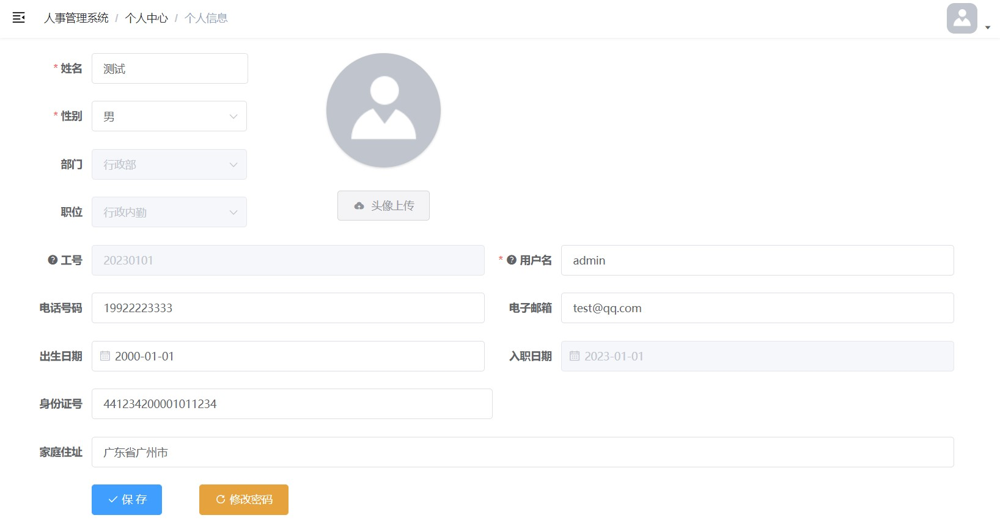

# 基于SpringBoot的人事管理系统

 毕设渣作，拿出来给有需要的朋友学习参考。


## 技术栈

基于前后端分离架构设计。该项目的前端部分选择在[vue-element-admin](https://github.com/PanJiaChen/vue-element-admin)的基础模板[vue-admin-template](https://github.com/PanJiaChen/vue-admin-template)上进行二次开发。

**后端技术**

- SpringBoot2框架
- SpringSecurity安全框架
- MyBatis持久层框架
- MySQL数据库

**前端技术**

- Node.js
- NPM
- Vue
- [ElementUI](https://element.eleme.cn/#/zh-CN)


## 运行环境

```
jdk 1.8
mysql 5.7.19
node v12.13.1
npm 6.12.1
nginx 1.12.2
```


## 功能实现

该系统主要模块分为**系统管理**模块、**人事管理**模块、**考勤管理**模块、**薪酬管理**模块和**个人信息管理**模块。

具体实现功能如下：

- 系统管理：**菜单权限管理**以及**角色管理**功能。
- 人事管理：**部门管理**、**职位管理**和**用户管理**功能。
- 考勤管理：用户**请假申请**和**请假审批**功能，员工**打卡签到**和**打卡记录**功能。
- 薪酬管理：**工资账套**设置、**工资发放**、**发放记录**和个人**工资查询**。
- 个人信息管理：**个人信息修改**、**密码修改**、**头像上传**。


### 系统管理

菜单管理可以选择启用/禁用某项功能，角色管理为角色分配相应的菜单权限。


### 人事管理

部门、职位和用户的增删改查。


### 考勤管理

员工可在此进行打卡签到，打卡会生成打卡记录；还可以进行请假申请，更高一级的角色可以对申请进行审批。

员工打卡签到的实现参考了以下项目：https://github.com/LIRUILONGS/hros


### 薪酬管理

个人感觉写得不好的一个模块，主要是当时不清楚企业是怎么发工资的。

还有一个小的问题就是，工资的发放和考勤是没有关联的。也就是说，你迟到、早退、请假也可以拿到全部工资:yum:

对这方面有需求的朋友可以自行研究一下，或者我后续再用到这个项目的话可能会进行更新。


### 个人信息管理




## 写在后面

写到后面过载了，可能会有些乱。

首页啥也没写，可以自己去[vue-element-admin](https://github.com/PanJiaChen/vue-element-admin)找一些合适的组件，或是自行添加一些背景。

默认测试用户为：账号**admin**，密码**123456**。

### 前端运行

之前没有前后端开发经验，这玩意儿困扰了我好久。

需要先启动Nginx，再在前端代码`/hros/hros-ui`下执行如下命令：

```
npm install
npm run dev
```

### 关于头像上传功能

用户头像上传功能，我用的是阿里云的OSS对象存储服务，当时免费试用的。

要使用头像上传功能，需要在`/common/service-oss/src/main/resources`下的application.properties配置你自己的OSS信息，并启动该服务。

即使不启动该服务，项目也能正常运行，只有头像上传功能不能正常使用而已。

